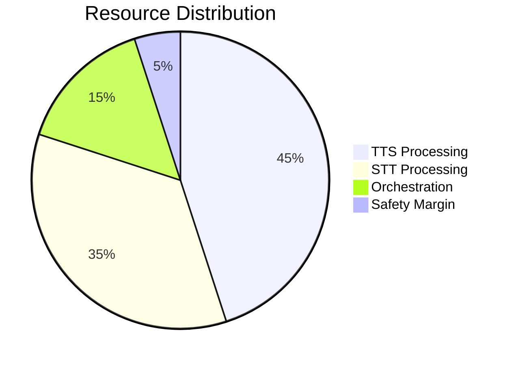
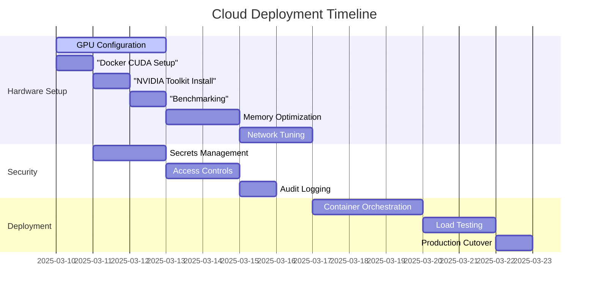
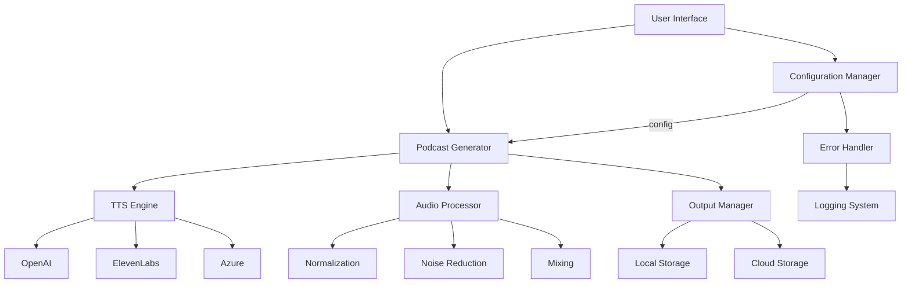

# Icelandic Voice Project Architecture Plan

## Cloud Deployment Architecture (RunPod)

### Hardware Allocation

### Network Architecture
- **Input Path**: /workspace/input_podcasts
- **Output Path**: /workspace/processed_podcasts
- **Temporary Storage**: /dev/shm for in-memory processing

### Security Implementation
1. Encrypted credential storage using Kubernetes Secrets
2. GPU isolation with NVIDIA MIG (Multi-Instance GPU)
3. Network policy enforcement between services
4. Read-only root filesystems for containers

### RunPod Optimization Checklist
- [x] L40 GPU driver validation
- [ ] CUDA 12.1 compatibility testing
- [ ] Shared memory configuration (40GB+)
- [ ] Network bandwidth stress testing

## Implementation Phases

### Phase 1: GPU Optimization
1. Update Dockerfile with CUDA 12.1 base
2. Implement NVIDIA Container Toolkit
3. Benchmark TTS performance across GPUs

### Phase 2: Memory Management
1. Configure shared memory pools
2. Implement model caching strategy
3. Set OOM thresholds

### Phase 3: Network Configuration
1. Setup dedicated VLANs
2. Implement QoS policies
3. Test bulk data transfers

## Table of Contents
1. [Current Architecture](#current-architecture)
2. [Proposed Improvements](#proposed-improvements)
3. [Implementation Roadmap](#implementation-roadmap)
4. [Future Enhancements](#future-enhancements)

## Current Architecture
- **Core Script**: Monolithic `generate_podcast.py`
- **UI**: Basic Streamlit interface (`streamlit_webui.py`)
- **Dependencies**: OpenAI-only TTS integration
- **Limitations**:
  - Hardcoded configuration
  - Minimal error handling
  - No audio post-processing
  - Single cloud provider dependency

## Proposed Improvements

### 1. Modular Architecture
- **Configuration Manager**: JSON/YAML + env vars
- **TTS Engine**: Provider abstraction layer
- **Audio Processor**: sox/ffmpeg integration
- **Podcast Builder**: Segment assembly logic
- **Error Handler**: Structured logging system

### 2. Enhanced Features
- Multi-provider TTS support (OpenAI, ElevenLabs, Azure)
- Voice cloning/presets system
- Real-time audio previews
- Automated post-processing pipeline

## Implementation Roadmap

### Phase 1: Core Architecture (1-2 days)
- [ ] Create `config_manager.py`
- [ ] Modularize codebase
- [ ] Implement basic error logging
- [ ] Setup CI/CD foundation

### Phase 2: TTS Enhancements (2-3 days)
- [ ] Abstract provider interfaces
- [ ] Develop voice presets system
- [ ] Build configuration UI
- [ ] Add audio preview functionality

### Phase 3: Productionization (1-2 days)
- [ ] Dockerize application
- [ ] Implement monitoring
- [ ] Create test suite
- [ ] Setup cloud storage integration

## Future Enhancements
- Voice cloning API integration
- Multi-language support
- Distributed rendering
- Automated quality analysis