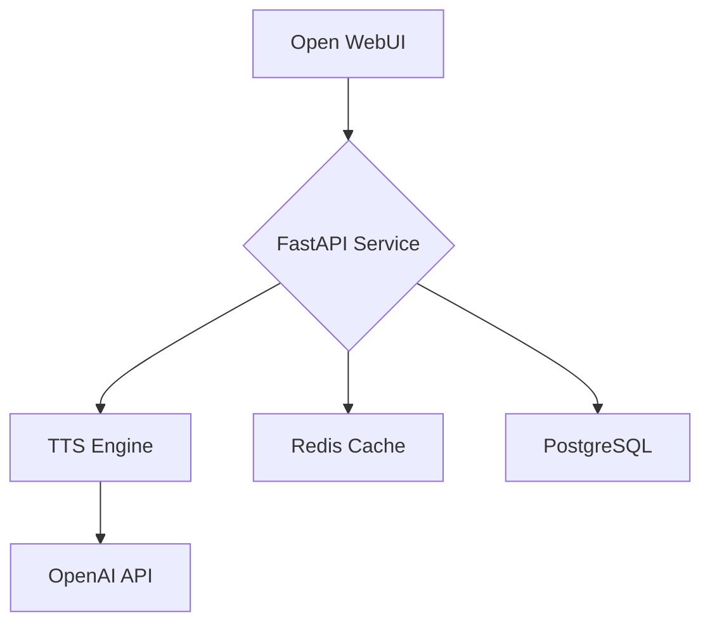

# Halloisland Open WebUI Integration

Integration of Icelandic TTS/STT capabilities with Open WebUI using FastAPI and Docker.

## Components

- **FastAPI Service**: Handles TTS/STT requests `/api/tts` and `/api/stt`
- **Open WebUI**: User interface for chat and voice interactions
- **Redis**: Caching layer for audio files
- **PostgreSQL**: Chat history and session storage

## Quick Start

1. Clone the repository:
```bash
git clone [your-repo-url]
cd halloisland
```

2. Set up environment variables:
```bash
cp .env.example .env
# Edit .env with your OpenAI API key
```

3. Start with Docker:
```bash
docker-compose up -d
```

4. Test the setup:
```bash
chmod +x test_setup.sh
./test_setup.sh
```

5. Access services:
- Open WebUI: http://localhost:3000
- API Docs: http://localhost:8000/docs

## Project Structure

```
.
├── api.py           # FastAPI application
├── tts_engine.py    # TTS implementation
├── docker-compose.yml
├── Dockerfile
├── requirements.txt
└── OPENWEBUI_SETUP.md
```

## Railway Deployment

See [OPENWEBUI_SETUP.md](OPENWEBUI_SETUP.md) for detailed Railway deployment instructions.

## Testing

1. Test TTS endpoint:
```bash
curl -X POST "http://localhost:8000/api/tts" \
     -H "Content-Type: application/json" \
     -d '{"text":"Halló Ísland", "voice":"alloy"}' \
     --output test.mp3
```

2. View API documentation:
```bash
open http://localhost:8000/docs
```

## Architecture



## License

MIT

## Contributing

See [ai-docs/README-contributing.md](ai-docs/README-contributing.md) for contribution guidelines.
