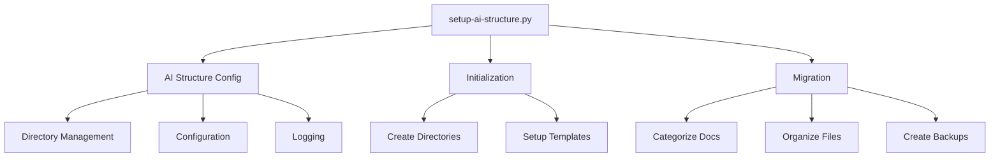

# Project Overview - Icelandic Voice Assistant System

## Directory Structure and File Purposes

### Root Directory
Primary application files:
- `tts_engine.py` - Core TTS engine implementation
- `webui.py` - Web interface implementation
- `icelandic_chat.html` - Chat interface template

### Documentation (`ai-docs/`)
```
ai-docs/
├── calls/
│   ├── responses/            # AI response templates
│   └── scenarios/           # Call handling scenarios
├── comparisons/             # Technology comparison docs
└── readme/                  # Core documentation
    ├── ARCHITECTURE.md
    ├── better_icelandic_voices_guide.md
    ├── icelandic_chat_implementation_guide.md
    ├── icelandic_voice_improvement.md
    ├── ICELANDIC_VOICE_SERVICES_README.md
│   ├── scenarios/            # Call handling scenarios
│   └── responses/            # AI response templates
└── comparisons/              # Technology comparisons
```

#### Documentation Templates
- `calls/scenarios/city_hall_reception.md`: Example scenario for city hall reception handling
- Other markdown files: Various documentation about voice technology implementation

### Configuration (`config/`)
```
config/
├── templates/                 # XML and other templates
└── settings/
    └── default_config.yaml   # Default configuration settings
```

#### Configuration Files
- `default_config.yaml`: Contains default settings for:
  - Voice configuration (TTS/STT)
  - Logging preferences
  - System settings

### Logs (`logs/`)
```
logs/
├── voice-logs/              # Voice processing logs
└── call-logs/              # Call handling logs
```

## File Purposes

### Core System Files
1. `setup-ai-structure.py`
   - Main CLI tool
   - Handles initialization, migration, and validation
   - Provides command-line interface for managing documentation

2. `src/setup/ai_structure_config.py`
   - Manages system configuration
   - Handles directory structure
   - Sets up logging
   - Loads and validates settings

3. `src/setup/initialize_structure.py`
   - Creates initial directory structure
   - Sets up basic documentation templates
   - Initializes configuration files

4. `src/utils/doc_migrator.py`
   - Migrates existing documentation
   - Categorizes documents by content
   - Creates backups before migration
   - Handles file organization

### Documentation Files
1. `ai-docs/calls/scenarios/*.md`
   - Contains call handling scenarios
   - Includes voice prompts and responses
   - Documents integration points
   - Provides testing procedures

2. `ai-docs/voice/tts/*.md`
   - Text-to-Speech implementation details
   - Voice configuration guides
   - Performance metrics
   - Integration instructions

3. `ai-docs/voice/stt/*.md`
   - Speech-to-Text implementation details
   - Recognition configuration
   - Accuracy metrics
   - Usage guidelines

4. `ai-docs/comparisons/*.md`
   - Technology comparisons
   - Performance benchmarks
   - Feature matrices
   - Cost analysis

### Configuration Files
1. `config/settings/default_config.yaml`
   - Default system settings
   - Voice configuration defaults
   - Logging preferences
   - Path configurations

2. `config/templates/*`
   - XML templates for voice systems
   - Configuration templates
   - Documentation templates

### Log Files
1. `logs/voice-logs/*`
   - Voice processing logs
   - Performance metrics
   - Error tracking
   - Usage statistics

2. `logs/call-logs/*`
   - Call handling logs
   - Response timing
   - Success rates
   - Error tracking

## System Components Interaction



## Key Features
1. **Documentation Management**
   - Organized structure for voice technology documentation
   - Clear separation of concerns
   - Easy navigation and maintenance

2. **Configuration System**
   - Centralized configuration management
   - Environment-specific settings
   - Easy customization

3. **Migration Tools**
   - Automated document organization
   - Content-based categorization
   - Safe migration with backups

4. **Logging System**
   - Comprehensive logging
   - Separate logs for different components
   - Performance tracking

## Usage Examples
1. Initialize new structure:
   ```bash
   python setup-ai-structure.py init
   ```

2. Migrate existing docs:
   ```bash
   python setup-ai-structure.py migrate
   ```

3. Validate structure:
   ```bash
   python setup-ai-structure.py validate