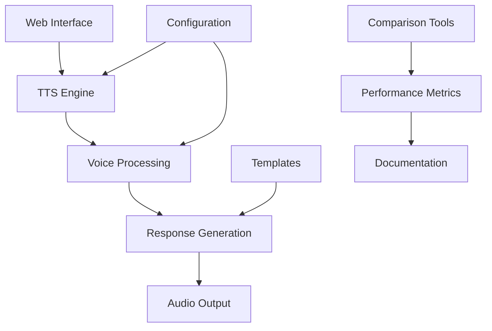

# Project Overview - Icelandic Voice Assistant System

## Directory Structure and File Purposes

### Root Directory

Primary application files:

- `tts_engine.py` - Core TTS engine implementation
- `webui.py` - Web interface implementation
- `icelandic_chat.html` - Chat interface template

### Documentation (`ai-docs/`)

```
ai-docs/
├── calls/
│   ├── responses/            # AI response templates
│   └── scenarios/           # Call handling scenarios
├── comparisons/             # Technology comparison docs
└── readme/                  # Core documentation
    ├── ARCHITECTURE.md
    ├── better_icelandic_voices_guide.md
    ├── icelandic_chat_implementation_guide.md
    ├── icelandic_voice_improvement.md
    ├── ICELANDIC_VOICE_SERVICES_README.md
    └── [other documentation files]
```

### Configuration (`config/`)

```
config/
├── settings/               # System configuration
│   ├── default_config.yaml
│   ├── docker-compose.yml
│   ├── Dockerfile
│   ├── requirements.txt
│   └── [other settings files]
├── src/                   # Source code
│   ├── setup/
│   │   ├── ai_structure_config.py
│   │   ├── config_manager.py
│   │   └── initialize_structure.py
│   └── utils/
│       └── doc_migrator.py
├── templates/             # Template files
│   └── generate_podcast.py
└── [comparison scripts]   # Testing and comparison scripts
    ├── icelandic_stt_comparison.py
    ├── icelandic_tts_comparison.py
    └── streamlit_webui.py
```

### Logs (`logs/`)

```
logs/
├── call-logs/            # Call processing logs
├── voice-logs/           # Voice processing logs
├── claude-code-log.md    # Development logs
└── cloudecode_log.md     # Cloud deployment logs
```

## Component Details

### Core Components

1. **TTS Engine (`tts_engine.py`)**
   - Main text-to-speech processing
   - Voice synthesis configuration
   - Audio output management

2. **Web Interface (`webui.py`, `icelandic_chat.html`)**
   - User interface implementation
   - Chat functionality
   - Voice interaction controls

### Configuration Components

1. **Settings**
   - `default_config.yaml`: System defaults
   - `docker-compose.yml`: Container configuration
   - `requirements.txt`: Dependencies

2. **Source Code**
   - Configuration management
   - Structure initialization
   - Documentation migration tools

3. **Templates**
   - Podcast generation
   - Response templates
   - Scenario templates

### Testing and Comparison

1. **Comparison Scripts**
   - STT comparison utilities
   - TTS comparison tools
   - Performance testing

2. **Development Tools**
   - RunPod deployment scripts
   - Azure CLI installation
   - Sample audio processing

## Documentation Organization

### Main Documentation

Located in `ai-docs/readme/`:
- Architecture documentation
- Implementation guides
- Service summaries
- Improvement plans

### Technical Documentation

- Call handling scenarios
- Response templates
- Voice technology comparisons
- Performance metrics

## Usage Examples

### Local Development

```bash
# Run TTS engine
python tts_engine.py

# Launch web interface
python webui.py
```

### Docker Deployment

```bash
# Build and run with Docker
docker-compose -f config/settings/docker-compose.yml up
```

### Testing

```bash
# Run comparison tests
python config/icelandic_tts_comparison.py
python config/icelandic_stt_comparison.py
```

## System Interaction Flow



## Key Features

1. **Voice Processing**
   - Icelandic TTS capabilities
   - Multiple voice options
   - Quality optimization

2. **Web Interface**
   - Interactive chat
   - Voice control
   - Real-time processing

3. **Configuration System**
   - Flexible settings
   - Docker support
   - Environment management

4. **Documentation**
   - Comprehensive guides
   - Technical documentation
   - Performance comparisons

5. **Testing Tools**
   - Comparison utilities
   - Performance metrics
   - Quality assessment

## Deployment Options

1. **Local Development**
   - Direct Python execution
   - Virtual environment support
   - Local testing tools

2. **Docker Deployment**
   - Containerized execution
   - Scalable deployment
   - Consistent environment

3. **Cloud Deployment**
   - RunPod support
   - Azure integration
   - Remote execution capabilities